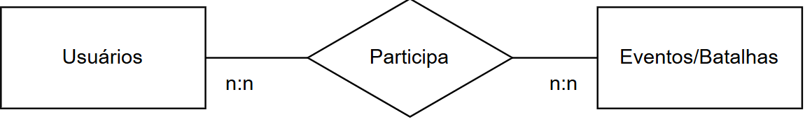
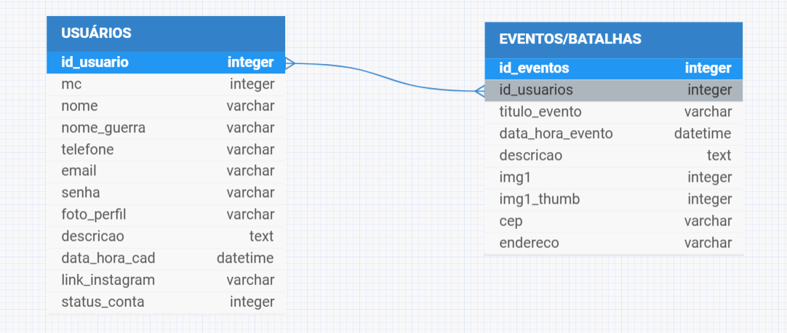

# Banco de Dados - VersoVivo
## Responsáveis pelo desenvolvimento:
- <a href = "https://www.linkedin.com/in/hellen-rodrigues-adolfo-388146258/" target="_blank" title="Linkedin">Hellen Adolfo</a>

- <a href = "https://www.linkedin.com/in/vitoria-dietrich-028b9b261/" target="_blank" title="Linkedin">Vitoria Dietrich</a>

- <a href = "https://www.linkedin.com/in/fh-silva/" target="_blank" title="Linkedin">Fabio Henrique</a>

## Descrição:
- Desenvolvendo...

## Três Níveis da Modelagem do Banco de Dados

### Modelo Conceitual


### Modelo Lógico


### Modelo Físico
```sql

    --
-- Banco de dados: `bd_versovivo_senac`
--

-- --------------------------------------------------------

CREATE DATABASE IF NOT EXISTS `bd_versovivo_senac`;

USE bd_versovivo_senac;

--
-- Estrutura para tabela `eventos`
--

CREATE TABLE IF NOT EXISTS `eventos` (
  `id_eventos` int(11) NOT NULL,
  `id_usuarios` int(11) DEFAULT NULL,
  `titulo_eventos` varchar(255) DEFAULT NULL,
  `data_hora_evento` datetime DEFAULT NULL,
  `descricao` text DEFAULT NULL,
  `imagem` varchar(255) DEFAULT NULL,
  `imagem_thumb` varchar(255) DEFAULT NULL,
  `cep` varchar(10) DEFAULT NULL,
  `endereco` varchar(255) DEFAULT NULL
) ENGINE=InnoDB DEFAULT CHARSET=utf8 COLLATE=utf8_general_ci;

-- --------------------------------------------------------

--
-- Estrutura para tabela `usuarios`
--

CREATE TABLE IF NOT EXISTS `usuarios` (
  `id_usuarios` int(11) NOT NULL,
  `mc` int(11) NOT NULL,
  `nome` varchar(255) DEFAULT NULL,
  `nome_guerra` varchar(255) NOT NULL,
  `telefone` varchar(15) DEFAULT NULL,
  `email` varchar(255) DEFAULT NULL,
  `senha` varchar(255) DEFAULT NULL,
  `foto_perfil` varchar(255) DEFAULT NULL,
  `descricao` text DEFAULT NULL,
  `data_hora_cad` datetime DEFAULT NULL,
  `link_instagram` varchar(255) DEFAULT NULL,
  `status_conta` tinyint(4) DEFAULT NULL
) ENGINE=InnoDB DEFAULT CHARSET=utf8 COLLATE=utf8_general_ci;

```